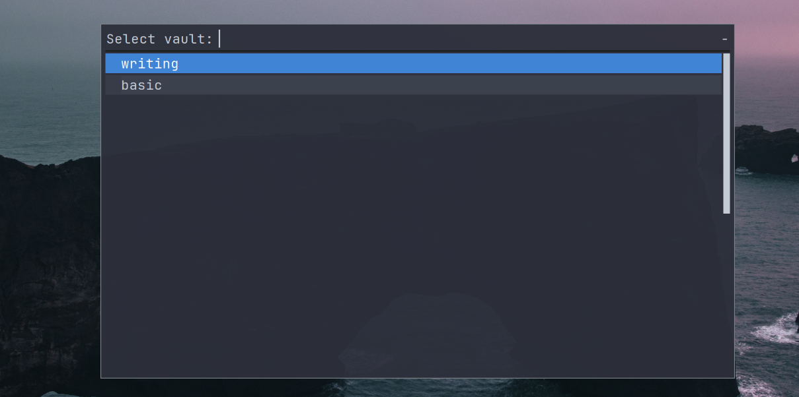

# Obsidian Vault Switcher – A shell script
A shell script implementing [rofi](https://github.com/davatorium/rofi) or [dmenu](https://tools.suckless.org/dmenu) to let you open the desired [Obsidian](https://obsidian.md) vault.



## Setup
1. Pick the right repo branch depending of if you use rofi or dmenu.
2. Open your first vault.
3. copy `~/.config/obsidian/obsidian.json` to `~/.config/obsidian/<vault_name>.json`
4. Repeat steps 2 and 3 with all the other vaults.
5. Replace all occurences of `vault_one`, `vault_two` etc. with the names of your vaults in the script.
6. If you use Wayland, also uncomment the rest of the last line.

## Functionality
Before launching Obsidian, the script manipulates `obsidian.json`, where the information about the last visited vault is stored.

Unfolded, the file kinda looks like this:

```json
{
    "vaults": {
        "3156ae10c753d15f": {
            "path": "/absolute/path/to/vault_one",
            "ts": 2930683392013,
            "open": true
        },
        "7924ea59d122e65e": {
            "path": "/absolute/path/to/vault_two",
            "ts": 6933482910304
        },
        "8156a7a7412569dd": {
            "path": "/absolute/path/to/vault/three",
            "ts": 5209508285286
        }
    }
}
```

The line `"open": true` makes *vault_one* start when launching Obsidian. So if we want to start *vault_two*, for example, the file should look like this:

```json
{
    "vaults": {
        "3156ae10c753d15f": {
            "path": "/absolute/path/to/vault_one",
            "ts": 2930683392013
        },
        "7924ea59d122e65e": {
            "path": "/absolute/path/to/vault_two",
            "ts": 6933482910304,
            "open": true
        },
        "8156a7a7412569dd": {
            "path": "/absolute/path/to/vault/three",
            "ts": 5209508285286
        }
    }
}
```

There is probably a more efficient way to do this, but at least it works for me.

¯\\_(ツ)_/¯

So, all the script does is overwriting `obsidian.json` with the files you created in steps 2 and 3 of [Setup](#setup).
